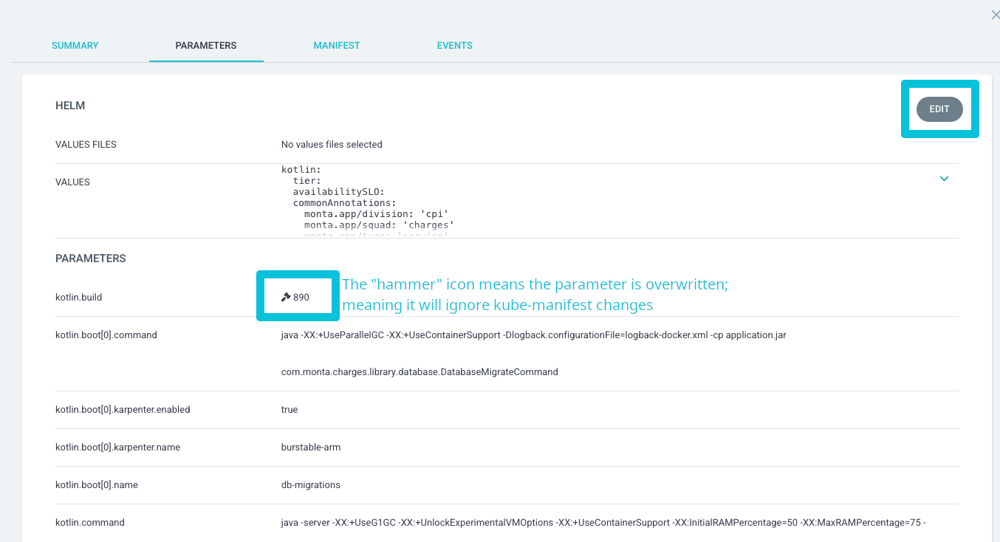

# GitHub Workflows v3 Migration Guide (LLM-Optimized)

## LLM Instructions

When performing this migration:
1. Apply ALL changes systematically - they are interdependent
2. Preserve existing configuration except where explicitly stated
3. Follow the exact parameter formats and ordering specified
4. Test after migration using the validation checklist

## Migration Changes

### 1. GitHub Workflow Files

#### Deploy Workflows (dev/staging/production)

**Update workflow reference:**
```yaml
# FROM:
uses: monta-app/github-workflows/.github/workflows/deploy.yml@v2

# TO:
uses: monta-app/github-workflows/.github/workflows/deploy-kotlin.yml@main
```

**Remove these parameters** (now defaults):
- `region: eu-west-1`
- `upload-open-api: true`
- `more-power: true`
- `java-version: 21`

**Parameter requirements:**
- Quote all values: `stage: "production"`
- Include `runner-size: "normal"` (or `"large"`)
- Order: `stage` → `runner-size` → other parameters

**Secrets mapping:**
```yaml
# Production:
AWS_ACCOUNT_ID: ${{ secrets.PRODUCTION_AWS_ACCOUNT_ID }}

# Staging:
AWS_ACCOUNT_ID: ${{ secrets.STAGING_AWS_ACCOUNT_ID }}

# Internal repos:
AWS_ACCOUNT_ID: ${{ secrets.INTERNAL_AWS_ACCOUNT_ID }}
```

Only pass secrets that exist in original deployment from:
`GHL_USERNAME`, `GHL_PASSWORD`, `AWS_ACCOUNT_ID`, `SLACK_APP_TOKEN`, `MANIFEST_REPO_PAT`, `SENTRY_AUTH_TOKEN`, `AWS_CDN_ACCESS_KEY_ID`, `AWS_CDN_SECRET_ACCESS_KEY`

If you used ArgoCD API to deploy before (by overwriting parameters) you need to remove the parameter overrides for image, tag and build number in ArgoCD.



#### Pull Request Workflow

```yaml
# FROM:
uses: monta-app/github-workflows/.github/workflows/pull-request-kover.yml@v2
with:
  action-runner: linux-x64-xl

# TO:
uses: monta-app/github-workflows/.github/workflows/pull-request-kotlin.yml@main
with:
  runner-size: "normal"
```

### 2. Dockerfile Updates

#### Add as first line:
```dockerfile
# syntax=docker/dockerfile:1
```

#### Update build stage:
```dockerfile
# FROM:
ARG GHL_USERNAME=NA
ARG GHL_PASSWORD=NA
ENV GHL_USERNAME ${GHL_USERNAME}
ENV GHL_PASSWORD ${GHL_PASSWORD}
RUN ./gradlew --no-daemon clean buildLayers

# TO:
RUN --mount=type=cache,target=/root/.gradle \
    --mount=type=secret,id=GHL_USERNAME,env=GHL_USERNAME \
    --mount=type=secret,id=GHL_PASSWORD,env=GHL_PASSWORD \
    ./gradlew --no-daemon clean buildLayers
```

#### Convert ENTRYPOINT to exec form:
```dockerfile
# FROM (shell form):
ENTRYPOINT java -server -XX:+UseG1GC ...

# TO (exec form):
ENTRYPOINT ["java", "-server", "-XX:+UseG1GC", "-XX:+UnlockExperimentalVMOptions", "-XX:+UseContainerSupport", "-XX:InitialRAMPercentage=50", "-XX:MaxRAMPercentage=75", "-XX:+UseStringDeduplication", "-jar", "/home/app/application.jar"]
```

### 3. Local Development Script (run_docker.sh)

```bash
# Replace entire build() function:
build() {
  export GHL_USERNAME="${GHL_USERNAME:-$(getProperty "gpr.user")}"
  export GHL_PASSWORD="${GHL_PASSWORD:-$(getProperty "gpr.key")}"
  
  DOCKER_BUILDKIT=1 docker build \
  --secret id=GHL_USERNAME,env=GHL_USERNAME \
  --secret id=GHL_PASSWORD,env=GHL_PASSWORD \
  -f Dockerfile \
  -t "$APP_NAME" ..
}
```

### 4. Production Deployment (Optional Features)

For production deployments with release management:

```yaml
name: Deploy Production

on:
  push:
    tags:
      - '*'
  workflow_dispatch:

concurrency:
  group: 'deploy-production'
  cancel-in-progress: true

jobs:
  deploy:
    uses: monta-app/github-workflows/.github/workflows/deploy-kotlin.yml@main
    with:
      stage: "production"
      runner-size: "large"
      service-name: "Your Service Name"      # Required
      service-emoji: "🚀"                   # Required
      service-identifier: "your-service"     # Required (lowercase)
      gradle-module: "app"                   # If multi-module
      enable-release-tag: true               # Optional: auto-tag on workflow_dispatch
      enable-changelog: true                 # Optional: generate changelog
    secrets:
      # Include only secrets that exist in your repo
```

## Parameter Reference

### Required Parameters
- `stage`: "dev" | "staging" | "production"
- `service-name`: Human-readable name
- `service-emoji`: Emoji for Slack
- `service-identifier`: Lowercase ECR/k8s identifier

### Optional Parameters
- `runner-size`: "normal" (default) | "large"
- `gradle-module`: For multi-module projects
- `enable-release-tag`: false (default) | true
- `enable-changelog`: false (default) | true
- `java-version`: "21" (default)
- `gradle-args`: "--no-daemon --parallel" (default)
- `region`: "eu-west-1" (default)

## Validation Checklist

- [ ] Workflows pass in GitHub Actions
- [ ] `docker history <image>` shows no credentials
- [ ] Local builds work with updated script
- [ ] Build times improved on subsequent runs

## Migration Benefits

- **Security**: Secrets not in image layers
- **Performance**: BuildKit caching
- **Simplicity**: Fewer parameters needed
- **Multi-arch**: ARM64 and AMD64 support
